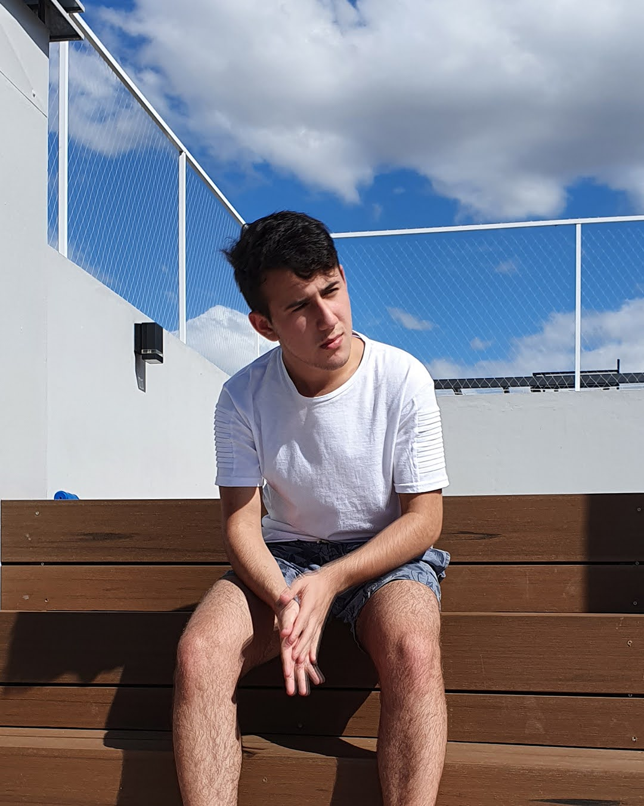

# Presentación

## Estudiante: Matias Gratz

## Hola! </h2>

 

### Soy Matías Gratz
- Estudiante Ingenieria en Sistemas de Información UTN.
- Streamer de hobby (al menos por ahora). 
- Actualmente queriendo aprender cosas nuevas, ajedrez,rubik,etc;

>the only impossible journey is the one you never begin.

⭐️ De [matiasgratz](https://github.com/matiasgratz)
